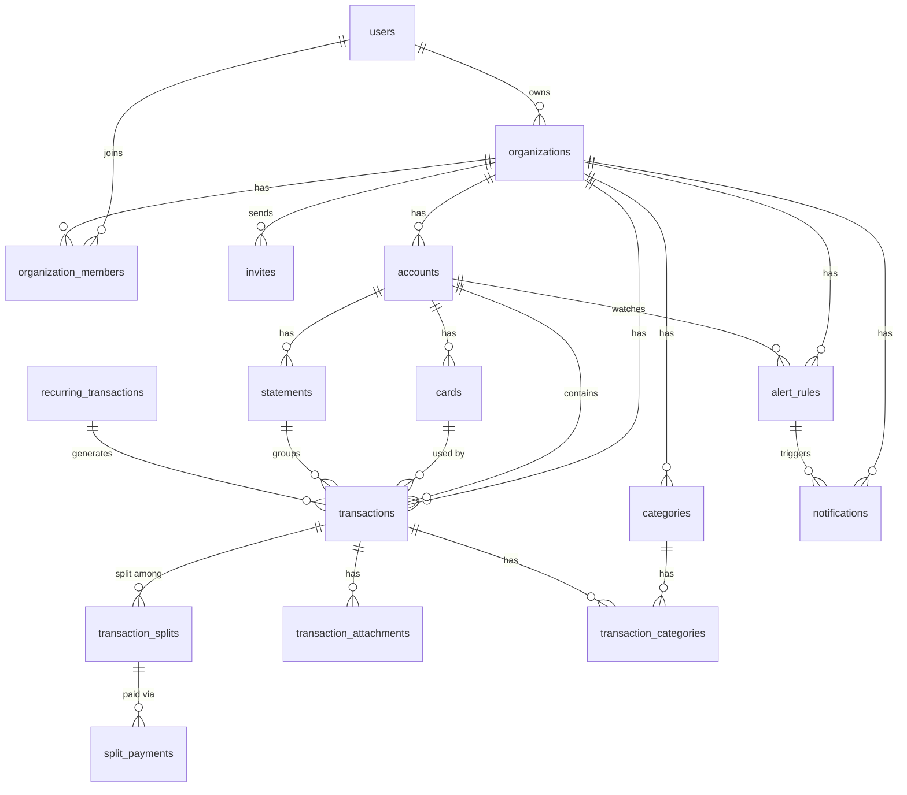
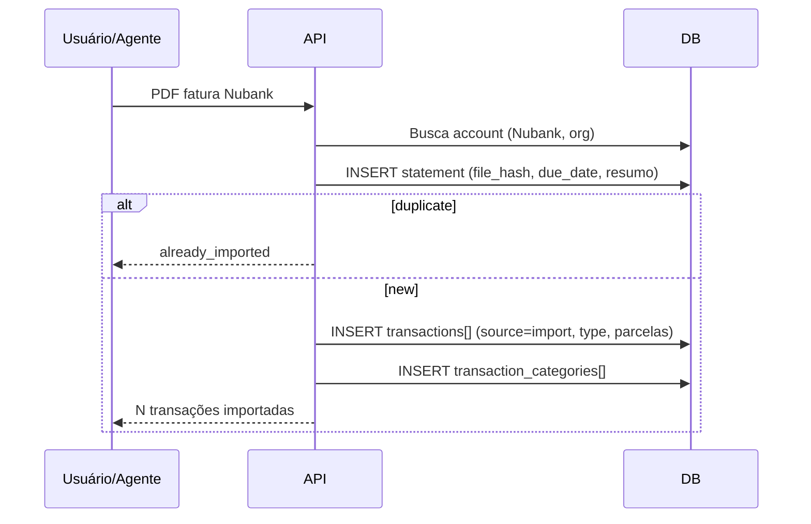

# Plano de Redesign — HouseApp Financeiro

Documento baseado no plano elaborado em **18/06/2026**. Descreve a reestruturação do HouseApp de um gestor de obrigações domésticas para um **gestor financeiro pessoal centrado em contas**.

---

## 1. Contexto e objetivo

### Problema do modelo atual

O sistema foi construído como **gestor de obrigações domésticas** (quem deve o quê a quem na casa), não como gestor financeiro pessoal. Consequências:

- Transações “soltas” — sem vínculo com Nubank, Itaú, Santander, dinheiro vivo ou investimentos
- Ocorrências obrigatoriamente ligadas a séries — difícil importar faturas PDF linha a linha
- `custom_reminders` com 20+ campos, duplicando lógica de recorrência e alertas
- Investimentos em 4 tabelas separadas, user-scoped, desconectados do fluxo de gastos
- Chat por transação, séries/ocorrências e lembretes como sistemas paralelos

### Objetivo do redesign

Centralizar **todos os gastos e receitas** em um único lugar:image.png

- Contas e cartões por organização (Itaú, Nubank, dinheiro, investimentos)
- Lançamentos manuais e importação de faturas PDF (com skill de agente no dev)
- Lembretes de fatura vencendo e transações avulsas (ex.: devolver empréstimo)
- Relatórios por conta, categoria e período
- Divisão de despesas e controle de quem deve o quê

### Veredicto

| Pergunta | Resposta |
|----------|----------|
| O sistema atual atende? | **Não** — precisa reestruturação forte |
| Reescrever do zero? | **Parcialmente** — schema novo; dados migram; domínio reescrito |
| Paradigma contábil | **Single-entry** (padrão Mint/YNAB/Monarch) |
| Open Finance agora? | **Não** — PDF/skill primeiro; schema preparado para `source = 'open_finance'` no futuro |

---

## 2. Princípios de arquitetura

1. **Contas são o eixo central** — todo movimento pertence a uma conta
2. **Transações são entidade de primeira classe** — não dependem de template/série para existir
3. **Lembretes não têm tabela própria** — transação pendente + `alert_rule`
4. **Uma tabela, um propósito** — sem sobreposição nem campos redundantes
5. **Naming profissional** — plural, `snake_case`, FKs `{tabela_singular}_id`, timestamps `_at`, booleanos `is_`
6. **Valores monetários** — `bigint` em centavos
7. **IDs** — CUID2 (`text`), consistente com o stack atual

---

## 3. Banco de dados

### 3.1 Visão geral (15 tabelas planejadas + 1 na implementação)

| Grupo | Tabelas |
|-------|---------|
| Identidade | `users`, `organizations`, `organization_members`, `invites` |
| Core financeiro | `accounts`, `cards`, `categories`, `transactions`, `recurring_transactions`, `transaction_categories` |
| Divisões | `transaction_splits`, `split_payments` |
| Import | `statements` |
| Anexos | `transaction_attachments` *(adicionado na implementação)* |
| Alertas | `alert_rules`, `notifications` |

**Total implementado:** 16 tabelas (`0000_init.sql`).

### 3.2 Diagrama de relacionamentos



### 3.3 Tabelas removidas (schema legado)

| Tabela antiga | Destino |
|---------------|---------|
| `transactions_series` | `recurring_transactions` |
| `transactions_occurrences` | `transactions` |
| `tags` | `categories` |
| `transaction_tags` | `transaction_categories` |
| `custom_reminders` | `transactions` (pendente) + `alert_rules` |
| `reminder_occurrence_transactions` | Eliminada |
| `transaction_chat_messages` | `transactions.description` |
| `alert_deliveries` | `notifications` |
| `user_organizations` | `organization_members` |
| `investment_*` (4 tabelas) | `accounts` tipo `investment` + `transactions` |
| `goals` | Já removida anteriormente |

### 3.4 Entidades principais

#### `accounts`

Recipiente de dinheiro, org-scoped.

- **Tipos:** `checking`, `savings`, `credit_card`, `cash`, `investment`
- **Campos relevantes:** `institution`, `credit_limit`, `closing_day`, `due_day`, `initial_balance`, `pix_key`, `color`, `icon`
- **Exemplos:** Nubank Ultravioleta, Conta Corrente Itaú, Dinheiro Vivo, CDB Inter

#### `cards`

Cartões vinculados a uma conta `credit_card` (1:N).

- Fatura e limite são da **conta**; cada **transação** pode referenciar `card_id`
- Tipos: `physical`, `virtual`, `additional`
- Status: `active`, `blocked`, `canceled` (bloqueio por fraude sem cancelar a conta)

#### `transactions`

Entidade principal de todo movimento financeiro.

| Campo | Propósito |
|-------|-----------|
| `account_id`, `card_id` | Onde saiu/entrou o dinheiro e qual cartão |
| `recurring_transaction_id` | Null = avulsa (manual, import, empréstimo) |
| `statement_id` | Agrupa linhas de uma fatura importada |
| `title`, `amount`, `type` | `income` \| `expense` \| `transfer` |
| `date`, `competence_date` | Vencimento vs competência (cartão) |
| `status`, `paid_at`, `paid_amount` | `pending` \| `paid` \| `canceled` |
| `counterparty` | Texto livre ("João", "Netflix") — substitui `pay_to_id` |
| `source` | `manual` \| `import` \| `recurring` \| `ai_chat` *(futuro: `open_finance`)* |
| `external_id` | Dedup em imports (`UNIQUE(account_id, external_id)`) |
| `installment_number`, `installments_total` | Parcelas (ex.: "Parcela 3/3" no import de fatura) |
| `transfer_pair_id` | Par de transferência (fase futura) |
| `description` | Notas — substitui chat e notes de reminders |

#### `recurring_transactions`

Template de recorrência (ex.: aluguel, internet).

- `frequency` + `interval` (daily/weekly/monthly/yearly)
- `category_id` default para transações geradas
- `last_generated_date` para job de materialização

#### `transaction_splits` + `split_payments`

Divisão de despesas e empréstimo de cartão.

- Split: quem deve (`user_id` ou `contact_name`), valor, status (`pending` \| `partial` \| `paid` \| `forgiven`)
- Pagamentos parciais registrados em `split_payments`; `split.paid_amount` é cache derivado
- **Gasto real:** `transaction.amount - SUM(splits.amount)`

#### `statements`

Importação de faturas PDF.

- `file_hash` + `account_id` com `UNIQUE` — evita reimportar o mesmo PDF
- Suporta PDF consolidado: um statement por cartão/conta, mesmo hash de arquivo
- **Resumo da fatura** (reconciliação): `previous_balance`, `payments_received`, `purchases_total`, `other_charges`, `next_invoice_balance`, `total_open_balance`
- Reconciliação alvo: `purchases_total + other_charges == total_amount` (ex.: Nubank jun/2026: 6.126,68 + 856,93 = 6.983,61)

#### `categories`

Substitui `tags`. Hierarquia opcional via `parent_id` (ex.: Alimentação > Restaurantes).

#### `alert_rules` + `notifications`

| Escopo | Uso |
|--------|-----|
| `organization` | Padrão global ("avisar 1 dia antes") |
| `account` | Fatura Nubank: avisar 5, 3, 1 dia antes |
| `recurring` | Aluguel: avisar 7 dias antes |

**Prioridade:** `recurring` > `account` > `organization`

Canais: `in_app`, `whatsapp`, `extension`

### 3.5 Como “lembretes” funcionam

Não existe tabela de reminders.

| Caso de uso | Implementação |
|-------------|---------------|
| Fatura vence dia 15 | `alert_rule` scope=`account` na conta Nubank |
| Pagar João R$200 emprestados | `transaction` pendente + `counterparty: "João"` |
| Internet todo mês dia 10 | `recurring_transaction` + alert_rule scope=`recurring` |
| Lembrete sem valor | `transaction` com `amount` null ou zero + `description` |

### 3.6 Convenções de naming

| Convenção | Exemplo |
|-----------|---------|
| Tabelas plural | `transactions`, `recurring_transactions` |
| FKs | `account_id`, `category_id` |
| Timestamps | `created_at`, `paid_at` |
| Booleanos | `is_active` |
| Junction tables | PK composta, sem `id` extra |

Schemas Drizzle: `api/src/db/schemas/`  
Migrations: `api/.migrations/0000_init.sql`, `0001_crazy_vulture.sql` (resumo de fatura)

---

## 4. Fluxos de uso

### 4.1 Importação de fatura PDF



**Skill de agente (dev):** parse PDF por instituição → JSON → `POST .../statements/import`

**Regras de import (Nubank e similares):**
- Compras → `type: expense`; pagamentos de fatura e estornos (valores negativos no PDF) → `type: income`
- Parcelas → `installmentNumber` + `installmentsTotal` (ex.: "Parcela 3/3")
- Resumo da fatura → campos opcionais no body (`previousBalance`, `paymentsReceived`, `purchasesTotal`, `otherCharges`, etc.)
- `cardLastFour` opcional — fatura Nubank consolidada não informa cartão por linha

### 4.2 Open Finance (futuro)

- Integração direta com Bacen: inviável para projeto pessoal
- Agregadores (Pluggy, Belvo): viável se virar produto comercial
- **Agora:** PDF + skill; schema aceita `source = 'open_finance'` sem breaking change

---

## 5. API

### 5.1 Problemas do modelo legado (resolvido em grande parte)

- ~79 endpoints com reminders, investments e alertas redundantes — **removidos**
- Reports monolítico — **substituído** por `summary`, `by-account`, `by-category`
- Naming inconsistente — **padronizado** em `/organizations/:slug/...` plural

**Pendente:** endpoints `/jobs/*` ainda sem proteção dedicada (`/internal/` + API key).

### 5.2 Superfície implementada (módulos em `api/src/modules/`)

```
Auth          POST /auth/sign-in|sign-up|validate|logout
Profile       GET  /profile
Organizations CRUD + members + invites
Accounts      CRUD /organizations/:slug/accounts
Categories    CRUD /organizations/:slug/categories
Transactions  CRUD + pay + bulk /organizations/:slug/transactions
Recurring     CRUD /organizations/:slug/recurring-transactions
Statements    GET|POST /organizations/:slug/accounts/:id/statements
Reports       summary | by-account | by-category
Alert rules   CRUD /organizations/:slug/alert-rules
Notifications GET|PATCH /notifications
AI Chat       POST /organizations/:slug/ai/chat (+ confirm/reject actions)
Jobs          GET|POST /internal/jobs (protegido por API key)
```

**Regras de naming:** sempre plural, `:id` genérico, verbos só em ações (`:id/pay`).

---

## 6. Frontend (Web)

### 6.1 Filosofia UX

Inspirado em Monzo, Copilot Money e Stacky (adaptado):

- **Home-centric** — situação financeira em ~10 segundos
- **Card-based** — blocos modulares e acionáveis
- **Mobile-first** — bottom tabs no mobile, sidebar slim no desktop
- **1 tap para agir** — pagar, criar, dividir sempre acessível

### 6.2 Navegação

**3 tabs principais + FAB:**

| Item nav | Rota | Propósito | Status |
|----------|------|-----------|--------|
| Dashboard | `/{org}` | Patrimônio, vencidas, splits, gastos | Implementado (`features/home`) |
| Lançamentos | `/{org}/transactions` | Lista, filtros, vencidas | Implementado |
| Contas | `/{org}/accounts` | Saldos, cartões, import PDF | Implementado |
| Configurações | `/{org}/settings` | Categorias, alertas, membros | Implementado |

**Pendente UX:** Quick Create compacto via FAB; bottom tabs mobile; sidebar slim 56px (hoje sidebar shadcn padrão).

**Legado:** `/{org}/dashboard` redireciona para `/{org}`.

### 6.3 Home — cards modulares

- Patrimônio líquido
- Contas (scroll horizontal com saldos)
- Vencidas (ação imediata: Pagar / Adiar)
- Quem me deve (splits pendentes)
- Próximas (7 dias)
- Gastos do mês (mini chart)

### 6.4 Drawer de transação

- **Quick Create:** título, valor, tipo, conta, data → Salvar ou "Mais detalhes"
- **Drawer completo (560px):** categorias, cartão, parcelas, recorrência, splits, notas/anexos
- **Drawers em cascata:** + Nova Conta / + Nova Categoria / + Novo Cartão (máx. 2 níveis)
- **Rodapé sticky:** Total, Meu valor (com splits), Status, botão primário

Referência visual: Stacky — drawer lateral, segmented controls, KPI cards, filtros em chips.

### 6.5 Alertas na UI

- **Configurações > Alertas:** defaults da organização
- **Detalhe da conta:** override inline ("Personalizado" badge)
- **Recorrência:** toggle "Usar padrão" vs personalizar

---

## 7. Chrome Extension

### Manter

- Background service worker (polling, notifications, badge)
- Ações rápidas: Pagar, Snooze, Ver no web
- Auth via cookie do web

### Simplificar popup

**Implementado** (~300 linhas): resumo + pendências/vencidas + quick actions. Sem KPIs ou gráficos completos.

---

## 8. Chat IA (agente executor)

O chat deixa de ser só consultivo e passa a **executar ações com confirmação**.

### Protocolo SSE

```
data: {"type": "text", "chunk": "..."}
data: {"type": "action_preview", "action": "create_transaction", "action_id": "...", "data": {...}}
data: [DONE]
```

### Ações suportadas

| Ação | Exemplo |
|------|---------|
| `create_transaction` | "Cria despesa R$150 Farmácia no Nubank" |
| `import_statement` | Upload PDF + "importa fatura" |
| `pay_transaction` | "Marca Netflix como pago" |
| `create_split` | "Divide com Ana e Maria" |
| `register_split_payment` | "Ana me pagou R$500" |

### Endpoints

```
POST /organizations/:slug/ai/chat
POST /organizations/:slug/ai/actions/confirm
POST /organizations/:slug/ai/actions/reject
```

Ações pendentes expiram em 5 min; nada executa sem confirm explícito.

---

## 9. Fases de implementação

| Fase | Escopo | Status |
|------|--------|--------|
| **1 — Schema** | 16 tabelas Drizzle, `0000_init.sql` | Concluído |
| **2 — API (módulos)** | accounts, cards, categories, transactions, recurring, splits, statements, attachments, reports, alerts, auth | Concluído |
| **3 — Frontend core** | Home cards, transações, contas, settings, drawer Stacky, import PDF | Concluído (refinos UX pendentes) |
| **4 — Chat IA** | SSE + confirm/reject + action preview no web | Concluído (expandir tools) |
| **5 — Extension** | Popup simplificado | Concluído |
| **6 — Skill PDF** | Parse por instituição no Cursor (dev) | Pendente |
| **7 — Legado** | Remover `http/schemas` antigos, código Orval de investments, proteger `/jobs` | Pendente |
| **8 — UX avançada** | Quick Create FAB, bottom tabs mobile, transferências entre contas | Pendente |

### Migração de dados (quando aplicável)

1. Criar schema novo em paralelo
2. Migrar: tags→categories, series→recurring, occurrences→transactions, investments→accounts+transactions, reminders→transactions+alert_rules
3. Validar contagens e integridade
4. DROP tabelas antigas

---

## 10. Resumo quantitativo

| Camada | Legado | Alvo / atual | Situação |
|--------|--------|--------------|----------|
| DB (tabelas) | 17 | 16 | Concluído |
| API (módulos) | ~79 endpoints espalhados | ~56 endpoints modulares | Concluído (jobs `/internal/` pendente) |
| Web (nav) | 5 + páginas mortas | 4 itens + home | Concluído (refinos UX pendentes) |
| Web (rotas) | 12 | ~10 úteis | Concluído |
| Extension (popup) | ~1370 linhas | ~300 linhas | Concluído |
| Domain legado | ~120+ arquivos | módulos + limpeza | Parcial (`http/schemas` órfãos) |

---

## 11. O que se perde (aceito)

- Chat em transações → campo `description`
- Planos de investimento detalhados (cotas, quotes) → simplificar; re-adicionar se necessário
- Dashboard completo na extension → só no web
- `owner_id` / `pay_to_id` como users do sistema → `counterparty` texto livre

---

## 12. Referências no repositório

| Recurso | Caminho |
|---------|---------|
| Índice da documentação | `docs/README.md` |
| Visão geral atual | `docs/EXPLICACAO_PROJETO.md` |
| Pendências técnicas | `docs/TODOS_INCONSISTENCIAS.md` |
| Schemas Drizzle | `api/src/db/schemas/` |
| Migration inicial | `api/.migrations/0000_init.sql` |
| Módulos da API | `api/src/modules/` |
| DI / serviços | `api/src/core/container.ts` |
| Storage (anexos) | `api/src/core/storage/` |
| Plano detalhado (Cursor) | `.cursor/plans/contas_e_carteiras_db_debf324d.plan.md` |

---

*Última atualização: 18/06/2026 — revisado após alinhamento com o código*
